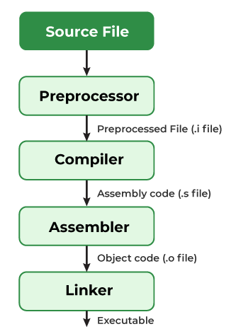
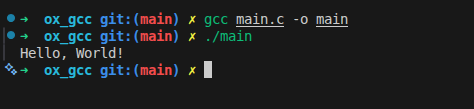
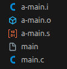

The compilation is the process of converting the source code of the C language into machine code. As C is a mid-level language, it needs a compiler to convert it into an executable code so that the program can be run on our machine.

The C program goes through the following phases during compilation:



Compilation Process in C

Understanding the compilation process in C helps developers optimize their programs.

# Steps to Compile and Run a C Program
We first need a compiler and a code editor to compile and run a C Program. The below example is of an Ubuntu machine with GCC compiler.

## Step 1: Create Source File

We first create a C program using an editor and save the file as main.c In linux, we can use vi to create a file from the terminal using the command:
```sh
touch main.c

subl main.c
```
Then write a simple hello world program and save it.


```C
#include <stdio.h>

int main() {
    printf("Hello World\n");
    return 0;
}
```
## Step 2: Compile using GCC Compiler

Use the following command in the terminal for compiling our main.c source file.

```sh
gcc main.c -o main
```
We can pass many instructions to the GCC compiler to different tasks such as:

- The option -Wall enables all compiler's warning messages. This option is recommended to generate better code. 
- The option -o is used to specify the output file name. If we do not use this option, then an output file with the name a.out is generated.

If there are no errors in our C program, the executable file of the C program will be generated.

## Step 3: Execute Program
After compilation, an executable file is generated.

```sh
./main // for linux
 main // for windows
 ```
The program will be executed, and the output will be shown in the terminal.



# Compilation Process
A compiler converts a C program into an executable. There are four phases for a C program to become an executable: 

- Pre-processing
- Compilation
- Assembly
- Linking

By executing the below command while compiling the code, we get all intermediate files in the current directory along with the executable.

```sh
gcc -Wall -save-temps main.c –o main
```

The following screenshot shows all generated intermediate files.



Below is the explanation for all the intermediate processes and files:

## 1. Pre-processing
This is the first phase through which source code is passed. This phase includes:

- Removal of Comments
- Expansion of Macros
- Expansion of the included files.
- Conditional compilation