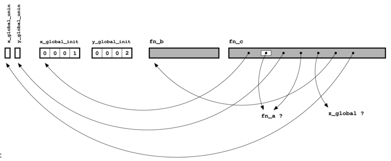

# What's in a C File

The first division to understand is between declarations and definitions. 

A definition associates a name with an implementation of that name, which could be either data or code:

- A definition of a variable induces the compiler to reserve some space for that variable, and possibly fill that space with a particular value.
- A definition of a function induces the compiler to generate code for that function.

A declaration tells the C compiler that a definition of something (with a particular name) exists elsewhere in the program, probably in a different C file. (Note that a definition also counts as a declaration—it's a declaration that also happens to fill in the particular "elsewhere").

For variables, the definitions split into two sorts:

- global variables, which exist for the whole lifetime of the program ("static extent"), and which are usually accessible in lots of different functions
- local variables, which only exist while a particular function is being executed ("local extent") and are only accessible  within that function

To be clear, by "accessible" we mean "can be referred to using the name associated with the variable by its definition".

There are a couple of special cases where things aren't so immediately obvious:

- static local variables are actually global variables, because they exist for the lifetime of the program, even though they're only visible inside a single function
- likewise static global variables also count as global variables, even though they can only be accessed by the functions in the particular file where they were defined

While we're on the subject of the "static" keyword, it's also worth pointing out that making a function static just narrows down the number of places that are able to refer to that function by name (specifically, to other functions in the same file).
For both global and local variable definitions, we can also make a distinction between whether the variable is initialized or not—that is, whether the space associated with the particular name is pre-filled with a particular value.

Finally, we can store information in memory that is dynamically allocated using malloc or new. There is no way to refer to the space allocated by name, so we have to use pointers instead—a named variable (the pointer) holds the address of the unnamed piece of memory. This piece of memory can also be deallocated with free or delete, so the space is referred to as having "dynamic extent".

## Putting it all together

| Kind | Where / state | Declaration | Definition |
|---|---|---|---|
| **Code** | Function | `int fn(int x);` | `int fn(int x) { ... }` |
| **Data: Global** | Initialized | `extern int x;` | `int x = 1;` *(at file scope)* |
| **Data: Global** | Uninitialized | `extern int x;` | `int x;` *(at file scope)* |
| **Data: Local** | Initialized | N/A | `int x = 1;` *(at function scope)* |
| **Data: Local** | Uninitialized | N/A | `int x;` *(at function scope)* |
| **Data: Dynamic** | Heap | N/A | `int *p = malloc(sizeof(int));` |

### Same table, original layout

| | Code | Global, initialized | Global, uninitialized | Local, initialized | Local, uninitialized | Dynamic |
|---|---|---|---|---|---|---|
| **Declaration** | `int fn(int x);` | `extern int x;` | `extern int x;` | N/A | N/A | N/A |
| **Definition** | `int fn(int x) { ... }` | `int x = 1;`<br>*(file scope)* | `int x;`<br>*(file scope)* | `int x = 1;`<br>*(function scope)* | `int x;`<br>*(function scope)* | `int *p = malloc(sizeof(int));` |

### Where each one lives in memory

| Definition | Memory section | `nm` letter |
|---|---|---|
| `int fn(int x) { ... }` | `.text` | `T` |
| `int x = 1;` (global) | `.data` | `D` |
| `int x;` (global) | `.bss` | `B` (or `C`) |
| `int x = 1;` / `int x;` (local) | stack | — |
| `malloc(...)` | heap | — |

An easier way to follow this is probably just to look at this sample program:

```c

/* This is the definition of a uninitialized global variable */
int x_global_uninit;

/* This is the definition of a initialized global variable */
int x_global_init = 1;

/* This is the definition of a uninitialized global variable, albeit
 * one that can only be accessed by name in this C file */
static int y_global_uninit;

/* This is the definition of a initialized global variable, albeit
 * one that can only be accessed by name in this C file */
static int y_global_init = 2;

/* This is a declaration of a global variable that exists somewhere
 * else in the program */
extern int z_global;

/* This is a declaration of a function that exists somewhere else in
 * the program (you can add "extern" beforehand if you like, but it's
 * not needed) */
int fn_a(int x, int y);

/* This is a definition of a function, but because it is marked as
 * static, it can only be referred to by name in this C file alone */
static int fn_b(int x)
{
  return x+1;
}

/* This is a definition of a function. */
/* The function parameter counts as a local variable */
int fn_c(int x_local)
{
  /* This is the definition of an uninitialized local variable */
  int y_local_uninit;
  /* This is the definition of an initialized local variable */
  int y_local_init = 3;

  /* Code that refers to local and global variables and other
   * functions by name */
  x_global_uninit = fn_a(x_local, x_global_init);
  y_local_uninit = fn_a(x_local, y_local_init);
  y_local_uninit += fn_b(z_global);
  return (y_global_uninit + y_local_uninit);
}
```

# What does a C compiler do?
The C compiler's job is to convert a C file from text that the human can (usually) understand, into stuff that the computer can understand. This output by the compiler as an object file. On UNIX platforms these object files normally have a .o suffix; on Windows they have a .obj suffix. 

The contents of an object file are essentially two kinds of things:

- code, corresponding to definitions of functions in the C file
- data, corresponding to definitions of global variables in the C file (for an initialized global variable, the initial value of the variable also has to be stored in the object file).

Instances of either of these kinds of things will have names associated with them—the names of the variables or functions whose definitions generated them.

Object code is the sequence of (suitably encoded) machine instructions that correspond to the C instructions that the programmer has written—all of those ifs and whiles and even gotos. All of these instructions need to manipulate information of some sort, and that information needs to be kept somewhere—that's the job of the variables. The code can also refer to other bits of code—specifically, to other C functions in the program.

Wherever the code refers to a variable or function, the compiler only allows this if it has previously seen a declaration for that variable or function—the declaration is a promise that a definition exists somewhere else in the whole program.

The job of the linker is to make good on these promises, but in the meanwhile what does the compiler do with all of these promises when it is generating an object file?

Basically, the compiler leaves a blank. The blank (a "reference") has a name associated to it, but the value corresponding to that name is not yet known.



With that in mind, we can depict the object file corresponding to the program given above like this: Schematic diagram of object file

# Dissecting An Object File

We've kept everything at a high level so far; it's useful to see how this actually works in practice. The key tool for this is the command nm, which gives information about the symbols in an object file on UNIX platforms. On Windows, the dumpbin command with the /symbols option is roughly equivalent; there is also a Windows port of the GNU binutils tools which includes an nm.exe.

Let's have a look at what nm gives on the object file produced from the C file above:
# Symbols from `c_parts.o`

| Name | Value | Class | Type | Size | Line | Section |
|---|---|:---:|---|---|---|---|
| `fn_a` | | `U` | NOTYPE | | | `*UND*` |
| `z_global` | | `U` | NOTYPE | | | `*UND*` |
| `fn_b` | `00000000` | `t` | FUNC | `00000009` | | `.text` |
| `x_global_init` | `00000000` | `D` | OBJECT | `00000004` | | `.data` |
| `y_global_uninit` | `00000000` | `b` | OBJECT | `00000004` | | `.bss` |
| `x_global_uninit` | `00000004` | `C` | OBJECT | `00000004` | | `*COM*` |
| `y_global_init` | `00000004` | `d` | OBJECT | `00000004` | | `.data` |
| `fn_c` | `00000009` | `T` | FUNC | `00000055` | | `.text` |

The output on different platforms can vary a bit (check the man pages to find out more on a particular version), but the key information given is the class of each symbol, and its size (when available). The class can have a number of different values:

A class of U indicates an undefined reference, one of the "blanks" mentioned previously. For this object, there are two: "fn_a" and "z_global". (Some versions of nm may also print out a section, which will be *UND* or UNDEF in this case)
A class of t or T indicates where code is defined; the different classes indicate whether the function is local to this file (t) or not (T)—i.e. whether the function was originally declared with static. Again, some systems may also show a section, something like .text
A class of d or D indicates an initialized global variable, and again the particular class indicates whether the variable is local (d) or not (D). If there's a section, it will be something like .data
For an uninitialized global variable, we get b if it's static/local, and B or C when it's not. The section in this case will probably be something like .bss or *COM*.
We may also get some symbols that weren't part of the original input C file; we'll ignore these as they're typically part of the compiler's nefarious internal mechanisms for getting your program to link.

