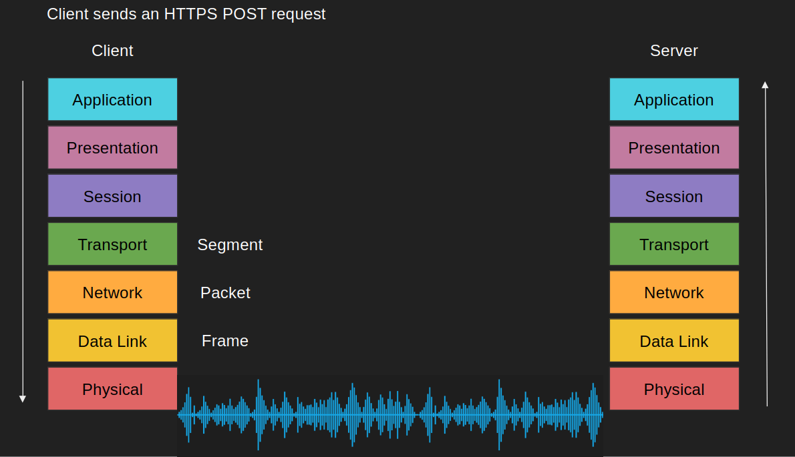
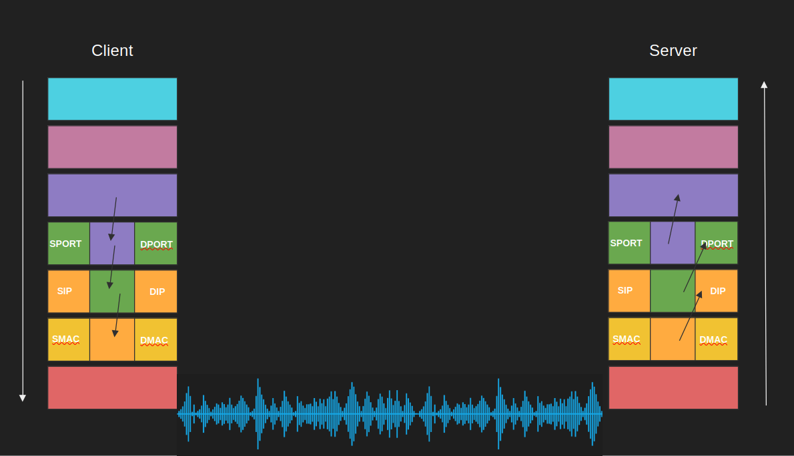
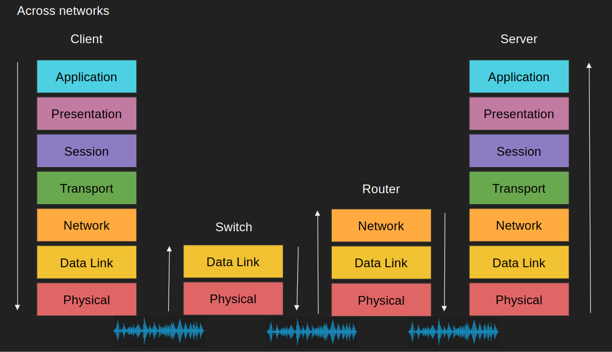
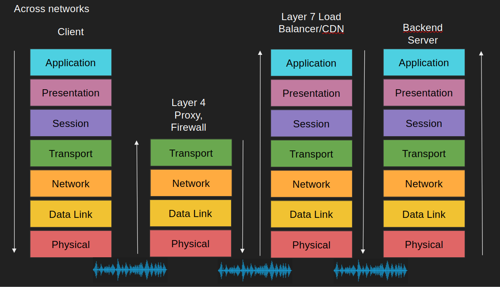
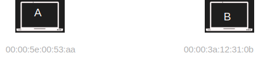
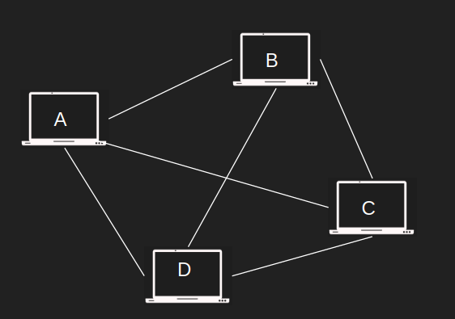

# OSI[Open Systems Interconnection] Model

## Why do we need a communication model?

- Agnostic applications
    - Without a standard model, your application must have knowledge of the underlying network medium 
    - Imagine if you have to author different version of your apps so that it works on wifi vs ethernet vs LTE vs fiber
- Network Equipment Management
    - Without a standard model, upgrading network equipments becomes difficult
- Decoupled Innovation
    - Innovations can be done in each layer separately without affecting the rest  of the models

## What is the OSI Model?
7 Layers each describe a specific networking component 

- Layer 7 - Application - HTTP/FTP/gRPC
- Layer 6 - Presentation - Encoding, Serialization 
- Layer 5 - Session - Connection establishment, TLS
- Layer 4 - Transport - UDP/TCP
- Layer 3 - Network - IP
- Layer 2 - Data link - Frames, Mac address Ethernet
- Layer 1 - Physical - Electric signals, fiber or radio waves

### The OSI Layers - an Example (Sender)
Example sending a POST request to an HTTPS webpage

- Layer 7 - Application
    - POST request with JSON data to HTTPS server  
- Layer 6 - Presentation
    - Serialize JSON to flat byte strings
- Layer 5 - Session
    - Request to establish TCP connection/TLS 
- Layer 4 - Transport
    - Sends SYN request target port 443
- Layer 3 - Network
    - SYN is placed an IP packet(s) and adds the source/dest IPs 
- Layer 2 - Data link 
    - Each packet goes into a single frame and adds the source/dest MAC addresses
- Layer 1 - Physical
    - Each frame becomes string of bits which converted into either a radio signal (wifi), electric signal (ethernet), or light (fiber) 

Take it with a grain of salt, it's not always cut and dry

### The OSI Layers - an Example (Receiver)
Receiver computer receives the POST request the other way around 

- Layer 1 - Physical 
    - Radio, electric or light is received and converted into digital bits
- Layer 2 - Data link 
    - The bits from Layer 1 is assembled into frames
- Layer 3 - Network
    - The frames from layer 2 are assembled into IP packet. 
- Layer 4 - Transport
    - The IP packets from layer 3 are assembled into TCP segments
    - Deals with Congestion control/flow control/retransmission in case of TCP
    - If Segment is SYN we don’t need to go further into more layers as we are still processing the connection request
- Layer 5 - Session
    - The connection session is established or identified
    - We only arrive at this layer when necessary (three way handshake is done)
- Layer 6 - Presentation
    - Deserialize flat byte strings back to JSON for the app to consume
- Layer 7 - Application
    - Application understands the JSON POST request and your express json or apache request receive event is triggered

Take it with a grain of salt, it's not always cut and dry

### The shortcomings of the OSI Model
- OSI Model has too many layers which can be hard to comprehend
- Hard to argue about which layer does what
- Simpler to deal with Layers 5-6-7 as just one layer, application
- TCP/IP Model does just that

### TCP/IP Model
- Much simpler than OSI just 4 layers
- Application (Layer 5, 6 and 7)
- Transport (Layer 4)
- Internet (Layer 3)
- Data link (Layer 2)
- Physical layer is not officially covered in the model

### OSI Model Summary
- Why do we need a communication model?
- What is the OSI Model?
- Example
- Each device in the network doesn’t have to map the entire 7 layers
- TCP/IP is simpler model

## Host to Host communication
How messages are sent between hosts

- I need to send a message from host A to host B
- Usually a request to do something on host B (RPC)
- Each host network card has a unique Media Access Control address (MAC)
- E.g. 00:00:5e:00:53:af

### Host to Host communication
- A sends a message to B specifying the MAC address 
- Everyone in the network will “get” the message but only B will accept it

- Imagine millions of machines?
- We need a way to eliminate the need to send it to everyone 
- The address needs to get better
- We need routability, meet the IP Address